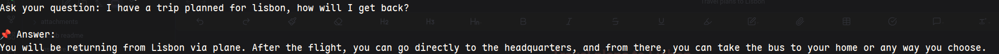
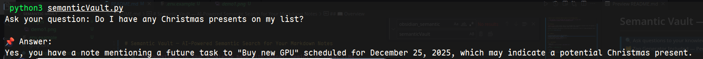

# Semantic Vault — AI-Powered Semantic Search for Your Markdown Notes

> 🔍 Ask questions to your knowledge base with OpenAI, Gemini, or Local LLMs  
> 🗂️ Tag Generator Included — Perfect for Obsidian Vaults

---

## 📖 Overview

**Semantic Vault** brings semantic search to your Markdown notes, optimized for Obsidian users but adaptable to any `.md` folder. Ask natural language questions and get relevant answers based on your notes.

Includes an AI-powered tag generator to enrich your notes automatically — great for organizing Obsidian vaults.

> 

> 

---

## 🚀 Features

✅ AI-Powered Semantic Search (Chat interface)  
✅ **Beautiful Web Interface** — Modern browser-based UI  
✅ Supports OpenAI, Gemini, and Ollama Local LLMs  
✅ Markdown & Obsidian Vault Friendly  
✅ AI Tag Generation Script — YAML Compatible  
✅ Easy Setup with `requirements.txt`

---

## 🛠️ Requirements

- Python 3.9+
- Dependencies (use the provided `requirements.txt`)

```bash
pip3 install -r requirements.txt
```

- Optional:
  - OpenAI API Key → [Get one](https://platform.openai.com/account/api-keys)
  - Google Gemini API Key → [Get one](https://aistudio.google.com/app/apikey)
  - Ollama for local LLMs → [See Ollama Setup](#-ollama-local-llm-optional)

---

## 📂 Project Structure

```
semantic-vault/
├── semanticVault.py      # Main Semantic Search Script
├── auto_tag_generation.py # AI Tag Generator for Markdown Notes
├── templates/
│   └── index.html        # Web UI template
├── requirements.txt      # Python dependencies
├── .env                  # API keys configuration (create this)
└── README.md
```

---

## 🔧 Setup

### 1. Clone the Repository

```bash
git clone https://github.com/renantmagalhaes/semantic-vault.git
cd semantic-vault
```

### 2. Install Dependencies

```bash
pip3 install -r requirements.txt
```

### 3. Configure Environment

Create a `.env` file:

```ini
OPENAI_API_KEY="your_openai_key_here"
GEMINI_API_KEY="your_openai_key_here"
```

Only required if using OpenAI or Gemini models.

---

## 💡 Semantic Search Usage

### 1. Set Your Vault Path

Edit `semanticVault.py`:

```python
VAULT_PATH = "/path/to/your/obsidian/vault"
```

### 2. Choose Your AI Model

In `semanticVault.py`:

```python
USE_MODEL = "openai"  # Options: "openai", "gemini", "ollama"
```

### 3. Run the Search Tool

**CLI Mode (Command Line):**

```bash
python3 ./semanticVault.py
```

Ask your question in the terminal, get AI-driven answers based on your notes.

**Web Interface Mode (Recommended):**

```bash
python3 ./semanticVault.py --web
```

Then open your browser to `http://localhost:5000` to access the beautiful web interface!

The web UI features:

- 🎨 Modern, responsive design with gradient themes
- 💬 Chat-style interface for natural conversations
- 📊 Real-time statistics (note count, model type)
- ⚡ Smooth animations and loading indicators
- 📱 Mobile-friendly responsive layout

---

## 🏷️ AI Tag Generator for Notes

Enrich your notes with relevant, AI-suggested tags.

### Usage

```bash
python3 ./auto_tag_generation.py
```

Optional flags:

| Flag        | Description                               |
| ----------- | ----------------------------------------- |
| `--dry-run` | Preview changes, no files modified        |
| `--force`   | Overwrite all existing tags with new ones |

Edit `tag_generation.py`:

```python
VAULT_PATH = "/path/to/your/obsidian/vault"
USE_MODEL = "openai"  # or "gemini" or "ollama"
```

✅ Tags are inserted in YAML frontmatter — ideal for Obsidian users.

---

## 🖥️ Ollama Local LLM (Optional)

Prefer privacy or offline capabilities? Run fully local models with [Ollama](https://ollama.com/).

### Install Ollama

```bash
curl -fsSL https://ollama.com/install.sh | sh
```

For Linux/macOS or check latest guides on [ollama.com](https://ollama.com/).

### Pull Models

Examples:

```bash
ollama run mistral
ollama run llama3
```

Edit:

```python
USE_MODEL = "ollama"
OLLAMA_MODEL = "mistral"
```

Supports lightweight, privacy-friendly models locally.

---

## 🌟 Future Plans

- Full-featured Obsidian Plugin (Separate project)
- Persistent chat mode to refine questions without losing context
- Scalable search for large vaults
- More advanced tag generation modes
- CLI improvements and advanced filters

---

## 📢 Contributing

Open to contributions — PRs, issues, suggestions welcome!

---

## 📜 License

MIT License — Free to use, modify, and distribute.

---

## 🤖 Acknowledgments

- OpenAI
- Google Gemini
- Ollama
- Inspired by Obsidian Copilot

---

## ✨ Stay in Control of Your Knowledge — Search Smarter
